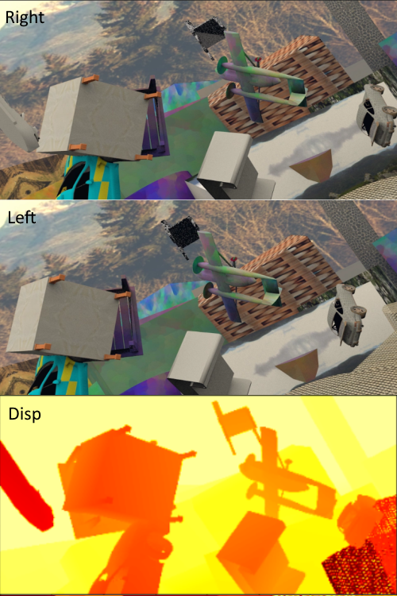
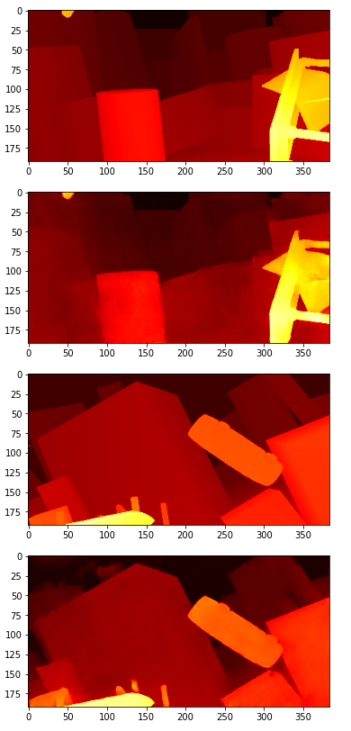

# DispNet
## Disparity Estimation Network Architecture

This is an attept to recreate the DispNet training env. via python and google cloud.

## Introduction

Paper by: N. Mayer, E. Ilg, P. Häusser, P. Fischer, D. Cremers, A. Dosovitskiy
Dataset: 

[Paper](https://arxiv.org/pdf/1512.02134.pdf)

[Datset](https://lmb.informatik.uni-freiburg.de/resources/datasets/FlyingChairs.en.html)

### Virtual Environment
- Using google cloud console, spin a VM instance with ubuntu-16.04-lts images and 1 Nvidia K80 GPU
- Drive memory 10GB or more

## Dataset preview

## Results

